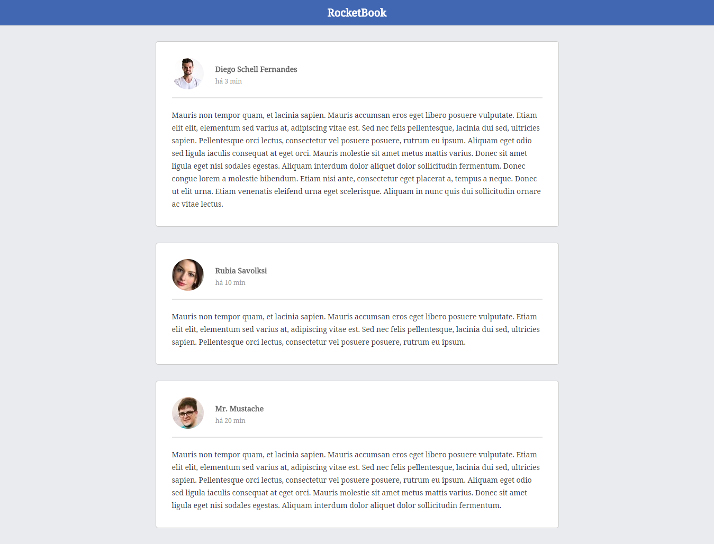

  <h3 align="center">1rd Rocketseat GoReact Challenge</h3>

---

## Overview

1rd challenge of the Rocketseat GoReact course.

## Preview

## Running the project

- Clone this repository
- Install all dependencies using the command `yarn`
- Run `yarn dev`
- Access `http://localhost:3000/`

## Used technologies

- React
- Other React JS libs
